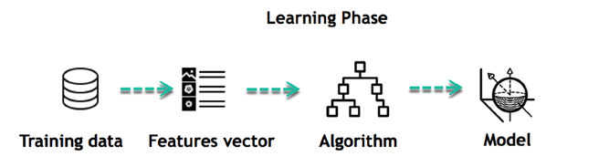
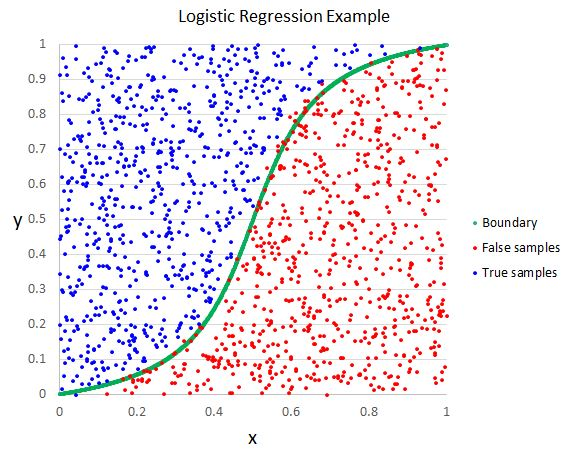

# Supervised Machine Learning Homework - Predicting Credit Risk

  

In this assignment, you will be building a machine learning model that attempts to predict whether a loan from LendingClub will become high risk or not. 

## Background

LendingClub is a peer-to-peer lending services company that allows individual investors to partially fund personal loans as well as buy and sell notes backing the loans on a secondary market. LendingClub offers their previous data through an API.

You will be using this data to create machine learning models to classify the risk level of given loans. Specifically, you will be comparing the Logistic Regression model and Random Forest Classifier.
- - -

## Logistic Regression

  

Initial Prediction:

I believed, due to how I had seen logistic regressions perform in other examples, that the logistic regression would have performed less accurately than the random forest classifier model. logistic regessions are used to compare and understand the relationship between the dependant and independant variables, and knowing this I know outliers and poor spreads can cause them to be inaccurate. Random forest classifiers, on the other hand, use more feature randomness and this in turn makes more accurate predictions than a model that follows an individual 'tree'. This is why I predicted that the Random Forest Classifier would run a more accurate model in the first round.

- - -

           
Prediction Accuracy

           
The random forest classifier ended up being more accurate than the logistic regression by about .067. While the difference in accuracy is marginal, the random forest classifier ended up being more accurate nonetheless. I believe this is mainly due to the reasons of the random forest classifier having more of a non linear nature. 

- - -

## Random Forest Classifier

  

Initial Prediction:

The initial prediction for the unscaled data to be in favor of the random forest classifier. The main reason was I believed that the noise prior to scaling would most likely cause the logistic regression model to not perform as well. While the random forest classifier model doesn't suffer from this I figured it would lead to a more accurate result. The scaled result was actually a bit surprising, as I had predicted that random forest classifier would still probably be more accurate. While the random forest classifier model stayed true to the original score the logistic regression model ended up being more accurate with scaling.

- - -

           
Prediction Accuracy

           
The logistic regression was more accurate by about .091 

## Final Thoughts
In the end I believe what this challenge shows us that there is no obvious choice in terms of choosing machine learning models. Each model has its pros and cons and it is best practice to use multiple models for any scenario that involves machine learning. Also, scaling is a powerful tool to use when pre-processing data and should not be overlooked, and a key takeaway: no matter how many times you have seen a model fail it can still out perform models that score higher on average.
